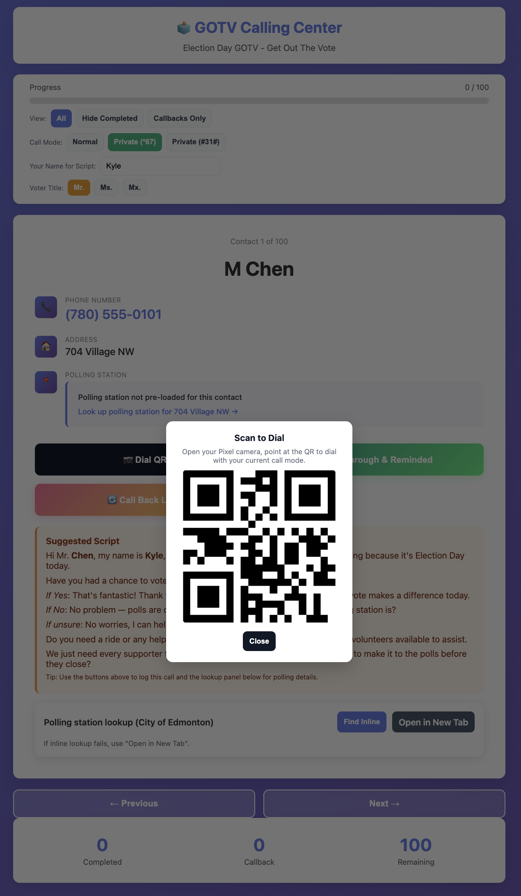

# GOTV Calling Center

🚀 **[Live Demo](https://kylemath.github.io/callingCenter)** 🚀

A local web interface for managing Election Day voter reminder calls.

## Features

- **One-by-one contact display** - Shows each contact with their full information
- **Click-to-call functionality** - Buttons to initiate calls directly from the interface (uses `tel:` protocol with *67 for caller ID blocking)
- **Status tracking** - Mark contacts as "Got Through & Reminded" or "Call Back Later"
- **Progress tracking** - Visual progress bar and statistics
- **Persistent storage** - Progress is saved locally in your browser
- **Polling station information** - Displays ward/district when available, with links to edmonton.ca/election for lookup

## How to Use

1. **Open the interface**: 
   - Simply open `index.html` in your web browser
   - Or run a local server: `python3 -m http.server 8000` and visit http://localhost:8000

2. **Making calls**:
   - Click the "📱 Call" button to initiate a call
   - The system will attempt to use *67 prefix for caller ID blocking
   - On mobile devices, this will open your phone dialer
   - On computers with calling capability (like Mac with iPhone), it will initiate the call

3. **Tracking progress**:
   - After each call, click "✅ Got Through & Reminded" if successful
   - Click "🔄 Call Back Later" if you need to try again
   - Use Previous/Next buttons to navigate if needed
   - Your progress is automatically saved

4. **Polling station lookup**:
   - For contacts with ward/district info, it's displayed automatically
   - For others, click the link to look up their polling station at edmonton.ca/election
   - Share this info during the call to help voters find their polling location

## Data Completeness

**Note**: Some contact details from the first page of the call list may need manual verification as they weren't fully visible in the image descriptions. All contacts from records #26-100 have complete information extracted from the source images.

If you notice any missing or incorrect data, you can edit `data.js` to update the contact information.

## Privacy & Security

- All data is stored locally in your browser (localStorage)
- No information is sent to any server
- This is a local-only application
- Phone numbers are kept confidential
- Remember to close the browser window when finished

## Resetting Progress

To start over or reset your progress, scroll to the end of the list and click "Start Over", or clear your browser's localStorage for this site.

## Tips for Effective Calling

- Polls are open until 8:00 PM
- Have edmonton.ca/election ready in another tab for quick lookups
- Keep the script from Instructions.md handy
- No need to leave voicemails
- Be politely persistent with callbacks

Good luck with the GOTV effort! 🗳️

## Preview

  

